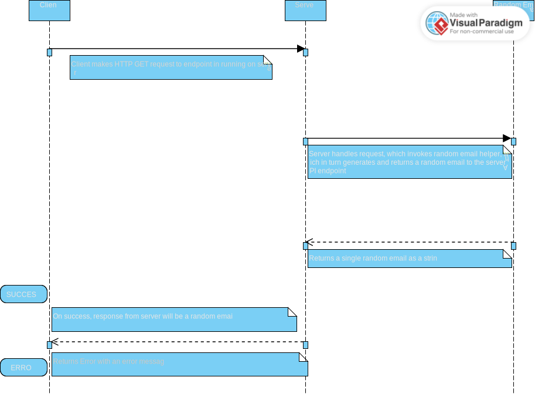

# rand_email_microservice

Requesting:
The randEmail.js file should not be changed.

The server.js file should not be changed except for the port number if you want to use a different one and maybe the route name. I used 'api' as a generic place holder, but if you have multiple routes, you will want to update this for your use case.

The index.js file is an example of how to hit the server.js endpoint using a HTTP GET request. Since you're writing your code with C++, you are going to want to write your own async / await function that will use the C++ equivalent to fetch('path') akin to the JS method below:

async function fetchEmail() {
try {
const response = await fetch("http://localhost:3000/api");
const data = await response.json();
return data;
} catch (error) {
console.log(error);
return new Error("Error", error);
}
}

Receiving:

After requesting, since it is a network call, just await the response using C++ syntax, and use the resulting random email string as you please. It is not a JSON object, it is strictly a single string, so you don't need to perform any methods on the received data to access the email.

UML Diagram:

